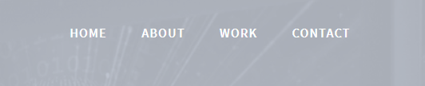
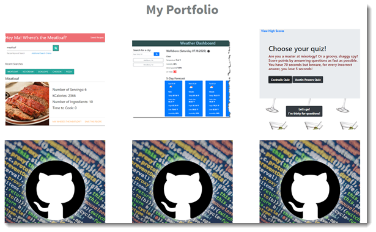
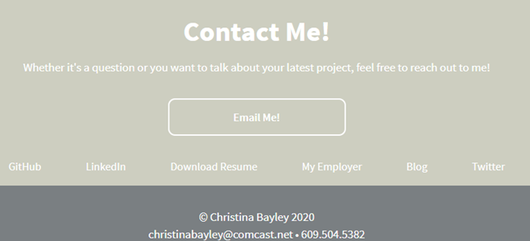

# My Portfolio
## Unit 08 Homework: Professional Materials

### TOC
* [Overview](#overview)
* [Application](#application)
* [Usage](#usage)
* [Credits](#credits)
* [License](#license)

## Overview
My portfolio contains information about me!  
  * You can read my bio, view some applications I've written, and see the "code" behind websites through my GitHub repo. 
  * I've included social media links (LinkedIn and Twitter), a link to my SaaSsySAP'er blog, and a link to my employer's page.
  * You can download my resume, email me, and call me.

## Application
Access my portfolio here: https://cbayley-edu.github.io/

Access the repo for my portfolio here: https://github.com/cbayley-edu/cbayley-edu.github.io

## Usage
#### There are convenient links across the top to allow you to quickly access the items mentioned above, or you can simply scroll down.
   

#### The work link will take you to My Portfolio where you can click on the top image to view the actual application or click on the bottom image to view the repository for the application. Hover over any of the pictures for a description of where it will take you.
   

#### Clicking Contact will allow you to contact me through email or phone. From here you can also access various links as shown below.
   

## Credits
Portfolio template downloaded from: https://dribbble.com/shots/2190459-Serenity-An-HTML5-Portfolio-Template
Designed by Chris Briddock

## License
MIT License

Copyright (c) 2020 Christina Bayley

Permission is hereby granted, free of charge, to any person obtaining a copy
of this software and associated documentation files (the "Software"), to deal
in the Software without restriction, including without limitation the rights
to use, copy, modify, merge, publish, distribute, sublicense, and/or sell
copies of the Software, and to permit persons to whom the Software is
furnished to do so, subject to the following conditions:

The above copyright notice and this permission notice shall be included in all
copies or substantial portions of the Software.

THE SOFTWARE IS PROVIDED "AS IS", WITHOUT WARRANTY OF ANY KIND, EXPRESS OR
IMPLIED, INCLUDING BUT NOT LIMITED TO THE WARRANTIES OF MERCHANTABILITY,
FITNESS FOR A PARTICULAR PURPOSE AND NONINFRINGEMENT. IN NO EVENT SHALL THE
AUTHORS OR COPYRIGHT HOLDERS BE LIABLE FOR ANY CLAIM, DAMAGES OR OTHER
LIABILITY, WHETHER IN AN ACTION OF CONTRACT, TORT OR OTHERWISE, ARISING FROM,
OUT OF OR IN CONNECTION WITH THE SOFTWARE OR THE USE OR OTHER DEALINGS IN THE
SOFTWARE.