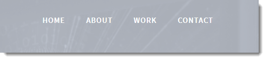
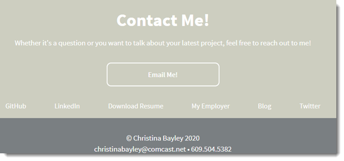

# Unit 08 Project 1 Homework: Professional Materials
# My Portfolio

## Overview

Access my portfolio here: https://cbayley-edu.github.io/

My portfolio contains information about me!  
  * You can read my bio, view some applications I've written, and see the "code" behind websites through my GitHub repo. 
  * I've included social media links (LinkedIn and Twitter), a link to my SaaSsySAP'er blog, and a link to my employer's page.
  * You can download my resume, email me, and call me.

## How to use the application

There are convenient links across the top to allow you to quickly access the items mentioned above, or you can simply scroll down.

The work link will take you to My Portfolio where you can click on the top image to view the actual application or click on the bottom image to view the repository for the application. Hover over any of the pictures for a description of where it will take you.

Clicking Contact will allow you to contact me through email or phone. From here you can also access various links as shown below.

## Credits

Portfolio template downloaded from: https://dribbble.com/shots/2190459-Serenity-An-HTML5-Portfolio-Template
Designed by Chris Briddock
